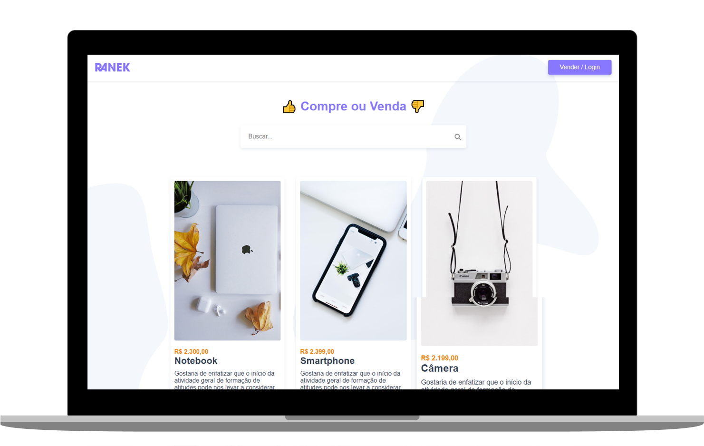

<h1 align="center">
  RANEK
</h1>

   
  
  
  

  

  

## ◾ Projeto

O Ranek é um Ecommerce Totalmente funcional feito com Vue.js. Foi um projeto para aprofundamento dos conhecimentos do framework.

#### Nele contem os seguintes conhecimentos:
* Validção de Login;
* Criação/Edição/Exclusão de usuário e de itens;
* CRUD Completo com os verbos HTTP;
* Consumo de API REST;
* Totalmente Reativo.

#### Visitar o site: [Ranek.com](https://ranek.origamid.dev/)

## ◾ Tecnologias

Esse projeto foi desenvolvido com as seguintes tecnologias:

- [HTML](https://developer.mozilla.org/pt-BR/docs/Web/HTML)
- [CSS](https://developer.mozilla.org/pt-BR/docs/Web/CSS)
- [JAVASCRIPT](https://developer.mozilla.org/pt-BR/docs/Web/JavaScript)
- [VUE.JS](https://br.vuejs.org/index.html)

## ◾ Licença

Esse projeto está sob a licença MIT.
